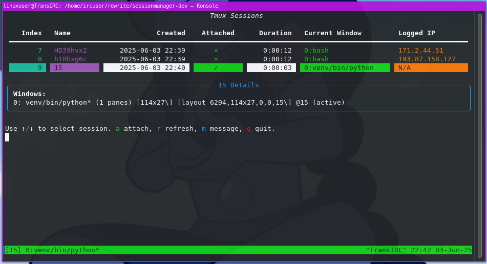

# 🧠 Session Manager for Tmux

A full-screen, interactive terminal interface for managing active `tmux` sessions --- with session info, live navigation, and the ability to send messages to users via `tmux display-popup`.

Built with ❤️ for the TransIRC project and retro-modern terminal workflows.

---



---

## ✨ Features

- 📊 Rich table UI for tmux session details (created time, attachment state, duration, current window, logged IP)
- 🧭 Navigate sessions with arrow keys
- 🔍 View detailed window lists per session
- ⌨️ Attach directly to a session
- ♻️ Refresh session list in real-time
- 📢 Broadcast messages via `tmux display-popup`
- 🧾 Detects real IP address (via `REAL_IP` environment variable)
- 🚦 Signal-safe and terminal-resize friendly

---

🚀 Requirements
---------------

-   Python 3.7+

-   `tmux` (>= 3.2 recommended)

-   Python packages:

    -   `readchar`

    -   `rich`

Install dependencies:

```
pip install readchar rich

```

🧰 Usage
--------

Use the arrow keys to navigate the list of active `tmux` sessions.

| Key | Action |
| --- | --- |
| ↑/↓ | Navigate sessions |
| `a` | Attach to selected session |
| `r` | Refresh session list |
| `m` | Send admin message to session(s) |
| `q` | Quit the manager |

* * * * *

📬 Messaging System
-------------------

You can send a short pop-up message to:

-   The currently selected session

-   All active sessions

Messages use `tmux display-popup` and are visible for 5 seconds.

* * * * *

🛠️ Environment Integration
---------------------------

If your tmux sessions expose a `REAL_IP` environment variable, it will be displayed in the session overview.

To set this manually in a session:

```
tmux set-environment REAL_IP 1.2.3.4

```

* * * * *

🤖 For Developers
-----------------

This tool is meant to be dropped into SSH environments, IRC shells, or BBS-style systems where tmux sessions represent active users.

Feel free to fork and adapt it to your own infrastructure!

* * * * *


🌐 Related Projects
-------------------

-   [Rich](https://github.com/Textualize/rich) --- Beautiful terminal output in Python

-   [readchar](https://github.com/magmax/python-readchar) --- Simplified key handling for terminal input

-   [tmux](https://github.com/tmux/tmux) --- Terminal multiplexer

